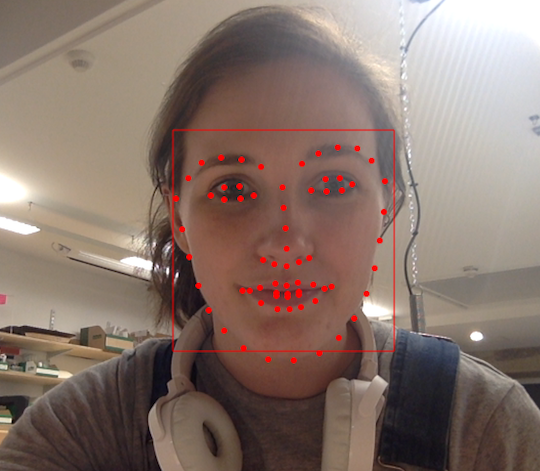

# Creative Process

### How does it work?

The program is written in OpenFrameworks and Arduino with OpenCV and DLib face tracker. It uses frame differencing and a function from the 05-Video-05-VideoCameraSynth example from Mastering Open Frameworks – Creative Coding Demystified Pg. 131 which I have adapted.

I added a Boolean to the DLib face tracker addon which allows me to track if a face is detected or not. When a face is detected this Boolean is set to true starting the program. A counter begins to increment and at a set time a serial message is sent to the Arduino IDE turning the lights on and the first function runs. This function uses pixel arrays to offset the colors of the film playing underneath along the x axis enabling you to see the faint outline of text. This continues for a set amount of time after which the second function is activated. The second function uses frame differencing to allow the user to wipe away their own image and see the film running below. When this function is activated the volume is turned on and the user can hear the track used in the performance as well as the conversation of the dancers in rehearsal.

So long as there is a face detected the program will continue to run. If a face is no longer detected the program will wait 3 seconds before the Boolean is set to false and it waits for a new user to re start it.

### Future Possibilities

I did originally consider having the underlying film show lines of pure data from the rehearsals. The dancer’s movement data, rehearsal location etc. However, I did not have time to collate this information. This will be my next step. I would also eventually like to create a version of this program that loads the users real time data into the background and so when they wipe away their own image it is their movement data that they are presented with.

Ideally when this piece is exhibited it should be shown with large stage lights and a slightly more theatrical setup (see sketch below). This equipment was not available to me at this time but will be considered for future showings. 

### References

http://alereimondo.no-ip.org/OpenCV/34
https://github.com/firmread/ofDemystified/tree/master/05-Video-05-VideoCameraSynth
https://github.com/roymacdonald/ofxDLib
https://github.com/lian/ofx-dev/tree/master/addons/ofxOpenCv
All footage comes from private rehearsals of a recent performance.
Mastering Open Frameworks: Creative Coding Demystified - Denis Perevalov

