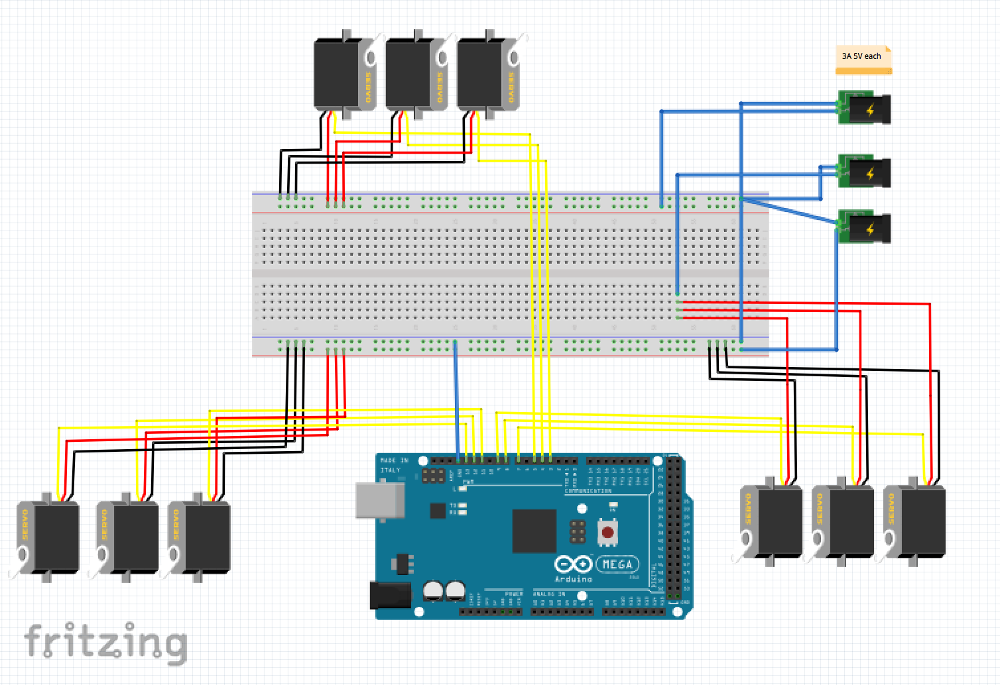
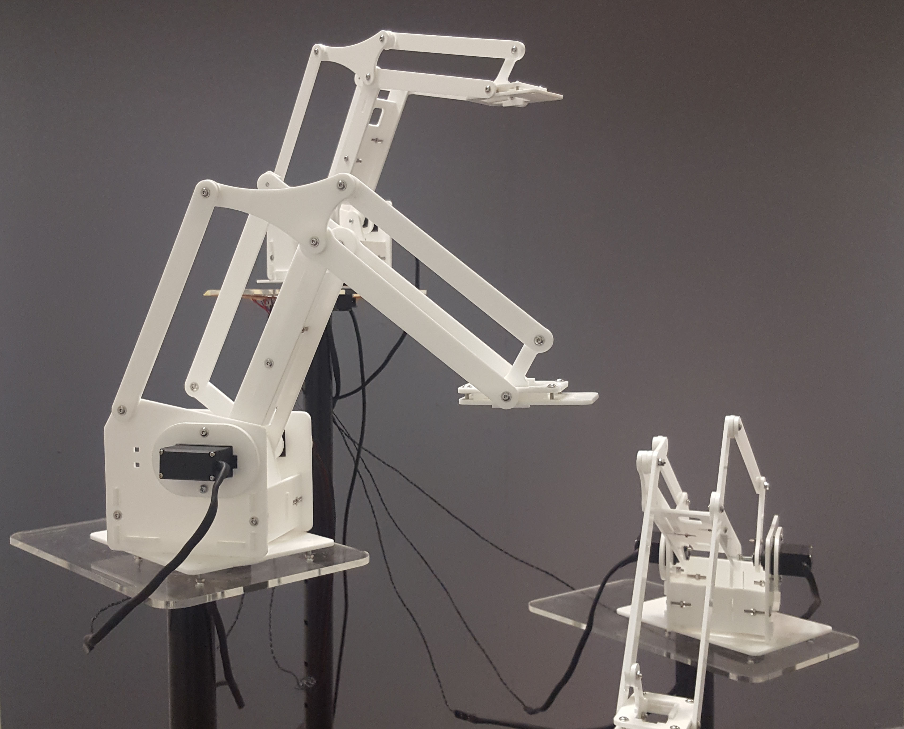
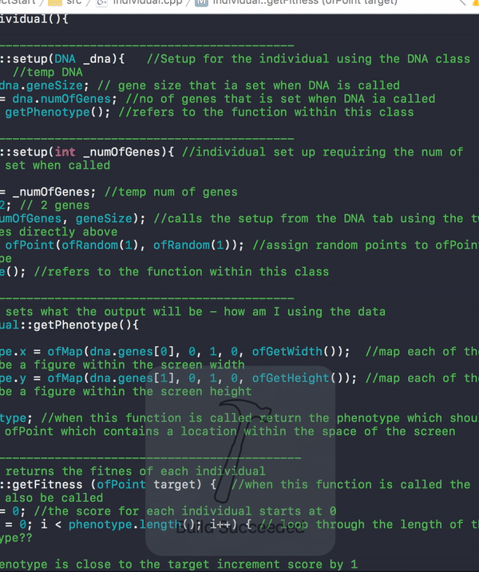
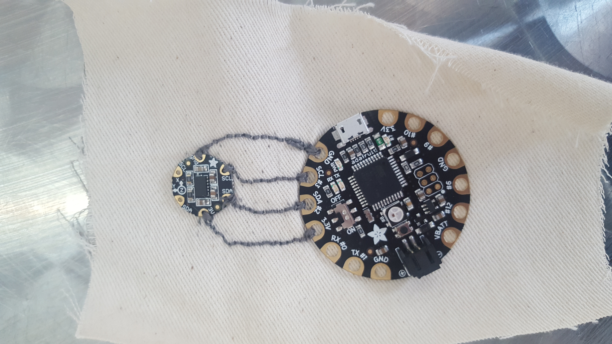
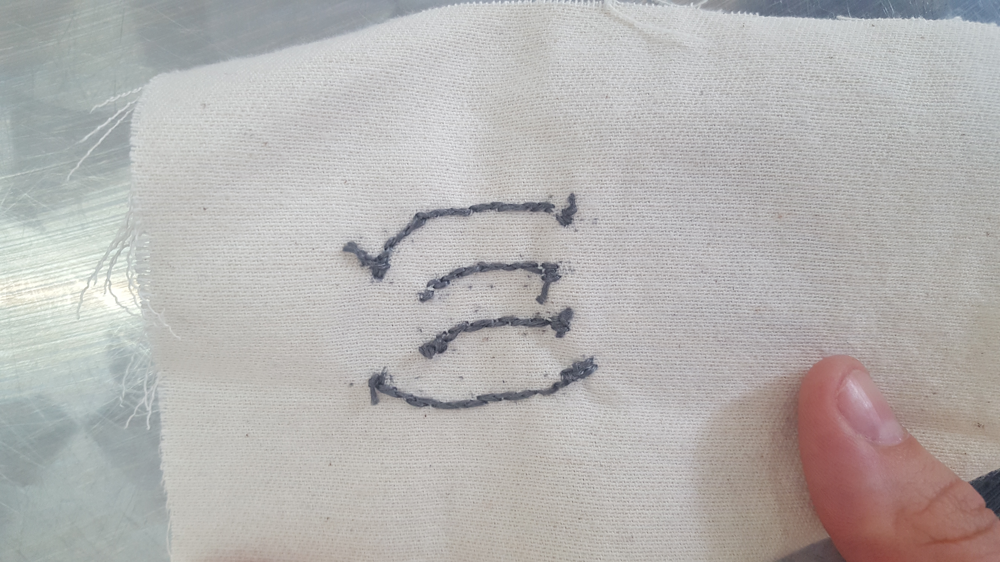
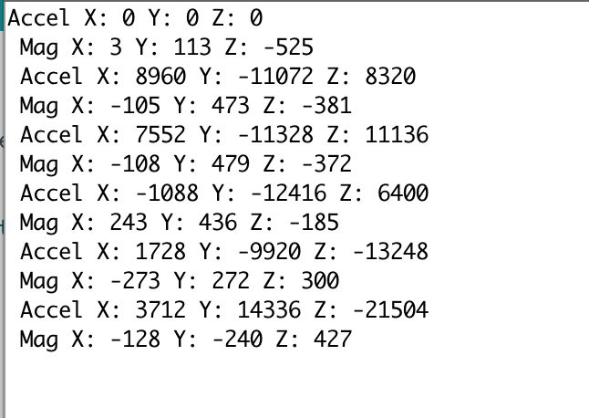
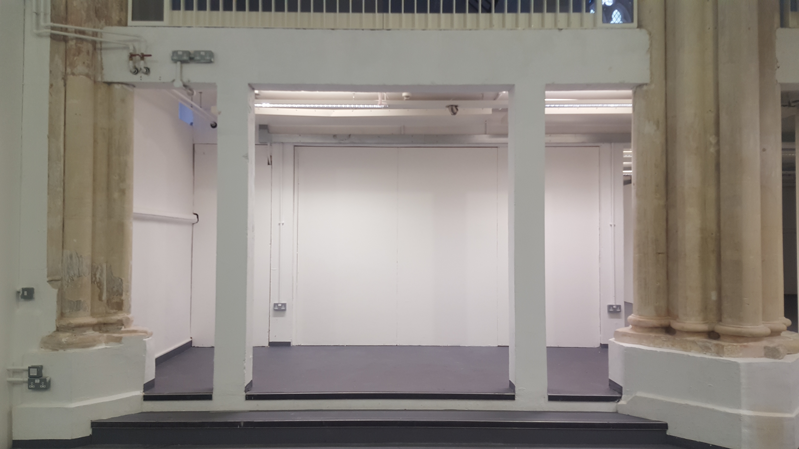
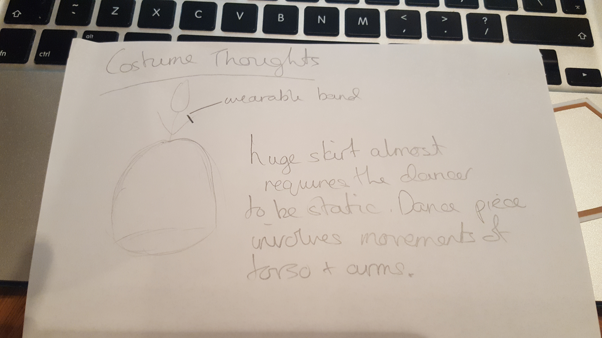

# Creative Process

## Creating the Piece

Dancers In White, Standing is the first practical exploration into what has previously been a largely theoretical research path into Artificial Intelligence (AI) and dance performance. I am Interested in exploring the non-human within dance performance and so decided to focus this project into finding a way to create a dance performance that included non-human performers.

A large challenge in creating a non-human performer is the audience. Often live performances rely on the audience’s ability to relate to the human performer and much of this relationship comes from shared sensory experiences. It is therefore natural that humans find it much harder to relate to non-human objects, an experience that is only intensified when the object is also a non-anthropomorphic.

To try and combat this my first instinct was to move away from a screen based performer. I felt that by giving something a physical form that exists in the same physical space as the human performer the audience would be more likely see it as an additional performer as opposed to set or decorative scenery.

Some of the artists/projects that inspired me whilst developing the concept of this piece are: Eric Minh Cuong Castaing, Zimoun, Industrial Improvisation, Pinokio, Fabricating Performance, Alexander McQueen, Madeline the Robot Tamer & Mimus

#### Building a Non-Human Dancer

Once I had decided that it was necessary for my non-human dancer to have a physical form I began to think about what form that would be. I wanted something that had its own unique movement style, had a certain amount of fragility, was not so small that it seemed like a toy and not too large that it became a set piece. I had no experience designing something like this so I began to look at what was available in the open source community. I found the [MeArm](https://mime.co.uk/products/mearm/) and decided to use this as my prototype non-human dancer.

The final design is not too far away from the meArm but I did have to make some fairly significant changes to the original design. I needed to scale it up and redesign the base of the arm to fit it onto my stands and also redesign the point at the front of the arm as I did not want to use the fourth motor. I have to spend some time improving the structural integrity of the arm which was lost slightly in the scaling up. This included cutting new parts using a laser cutter to deal with the extra weight and adding new points of contact to improve stability. I also needed to source stronger servo motors to cope with the increased weight.

I didn't want to use just one arm and I felt strongly that it should be an odd number so as not to mimic the design of the human body. The final number settled on is three.

Cardboard Prototype:

Schematic:

Three Arms Together:

Final Layout:

#### Equiptment Used

* Acrylic
* Stands
* Servo Motors - 8x MG90S
* Arduino Mega 2560
* PowerSupply

Useful forum thread with information about powering servos through mains/battery opposed to running through Arduno [Instructables - Using Arduino and 8 servos!? What type of power source?](http://www.instructables.com/answers/Using-Arduino-and-8-servos-What-type-of-power-so/)

#### Programming a Non-Human Dancer

To establish a relationship between the human dancer and the non-human dancers I needed to find a way of creating awareness. The human dancer can easily be aware of the non-human but what about the reverse? I needed to find a way for the non-human dancer to see the movements of the human dancer. Written in openFrameworks, I decided to use computer vision, more specifically blob detection and colour tracking. A Kinect checks every pixel in an image for a blob (more than one pixel) of a specific colour, in this case pink. It then finds the location of the central point of this colour blob which becomes the x and y coordinates that will be sent. The Kinect then takes these x, y coordinates and calculates the depth in a grayscale image. The darker the colour the farther away the points. This colour is converted into real world data which then becomes the z coordinate. 

The x, y, z coordinates become the ‘vision for the non-human dancer. They are sent from openFrameworks via a serial connection across to the Arduino Mega that controls the robotic arms. The non-human dancer can now understand the exact location of a specific part of the human dancers body in space. The coordinates are sent along with a message which indicates to the Arduino what it should do with these coordinates. Once the Arduino has received the coordinates it then maps the data to the servo motor range and instructs the motors to move to that location.

I did not want the arms to be continually moving and also did not always want the movement of the arms to mirror human motion. I decided to use the music as a timer through the piece, when different events occur in the musical score the movement or both the dancer and the non-human dancer adapts. I also experimented with different choreographic techniques such as cannon, repetition and call and response. One of the more complex problem to solve was how to make the arms move on their own while the dancer was static. At first I attempted to use random movement but the outcome was very unsatisfying. Instead I created a buffer of data saved from a previous section of movement which was then saved and sent to the Arduino when the command came around. I preferred this option as there was a faint echo of the movements performed by the dancer previously.

#### Practice Based Research

It is important for me to take a practice as research approach to this project as this is how I have always worked in my own choreographic practice.
First steps working with a genetic algorithm I hoped to replicate the thought processes of a human dancer. The logic of GA's is very similar to that of an improvising dancer and I wanted to exploit this and to create data that could be used to manipulate my robotic arm.
What happened? I spent roughly one month implementing a trial algorithm that I could use as a proof of concept. You can see the results of that in this very short video here. The code can be viewed on this projects Github repository.

As you can see there is a huge amount of data (represented as points) when thinking abut mapping this data to the arm I would have to map it to movements of a much, much smaller range. This is problematic as the data would effectively become randomized eliminating the need for the algorithm.
Conclusion. I considered keeping the algorithm in place as I was particularly drawn to it conceptually however when thinking about audience reception I realized that the audience would not be able to see any connection between the human dancer and the arm. Without this connection I feel that it will be difficult for the audience to engage and so I decided that it was time to pursue a different approach.

1. Kinect
Data path - Kinect --> OFW --> Arduino --> Servo
Would need to convert from depth data to x, y and z coordinates
Have a play with processing --> Kinect1 examples, println data and see if can be sent across efficiently to Arduino library
Also think about Kinect in OpenFrameworks can I replicate the processing example? getWorldCoordinate() gives co-ordinates for depth point

[Nice article about using background subtraction based on color and depth data](https://www.ncbi.nlm.nih.gov/pmc/articles/PMC3758628/)

2. Accelerometer
Data path - Accelerometer --> Arduino --> Servo
Nice example code comes with Arduino library, in the Inverse Kinematics example would need to edit goToPoint(from accelerometer)
How do I get the data to Arduino wirelessly?

 

#### Testing

-Kinect depth transferred into real world coordinates
-Optical flow
-Colour tracking combined with background extraction for accuracy (only gives x, y coordinates. How can I get the z?)
-Computer Vision

#### Choreography and Music

The arms move in a very angular and determined way and so I started my choreographic explorations by also moving in this way. Making very direct and obvious gestures. This was a useful exploration as it helped me to understand more clearly the relationship that exists between the non-human and the human dancer. Ultimately I desired something a little more nuanced. I started working with large sweeping circular movements of the upper body. Keeping the lower body firmly planted in place. When watching back rehearsal videos I felth that there was something of interest. The movements performed by the human dancer and the non human dancer where visually quite different but there was an obvious connection there. It was easy for me to see how the human dancers movements where effecting the non-humans and vice versa. 

The music is composed by [Jacob Glock] (https://soundcloud.com/jakob-glock). I consider this music essential to holding the piece together. It is created using recordings from nature which are mixed to give a somewhat unatural sound score. If we think about the themes and motivations behind this peice. A perfect score to use!

#### Stage Design/Exhibition Presentation

The Space I was given:

The steps up to the space give it the feel of an informal stage, not imposing when there is no performance but remnant or a traditional proscenium arch re-enforcing that this piece, although shown in an exhibition setting, is very much intended for performance.

Once the space had been chosen I experimented with different staging options. I wanted to fill the space and give both the non-human dancer and the human dancer individual space. I settled on this configuration:

I also had to consider how I would show the work during the exhibition outside of the performance setting. I knew that I would have a video of the work playing but I also wanted to find a way of having the robotic arms moving. It was very important to me that they not lose their integrity as performers and so I decided not to have them move constantly. After considering the relationship that I wanted them to have with the audience I also decided against having them move in response to audience motion. I felt that this moved away from them being performers and moved more into the realm of interactive art. My final decision was to have them move when the video is being watched. I achieved this by using face tracking. When someone is watching the video their face is detected, if they stay for longer than 5 seconds data is sent to the Arduino and the arms will move. Once the person moves away the arms will stop moving. They only move when someone is paying attention to them.

#### Costume Design

Initial Costume sketch:

#### Future Development

I can see a lot of potential for future development within this work. As with many live performance pieces it can remain fluid, adapting for the needs of each showing. Perhaps at times it becomes a more intimate performance with just one non-human dancer or in a different situation it can become an ensemble piece with many non-human and human dancer sharing the stage.

Before adapting any of the computational side I would like to work intensively with the robotic arms and other movement artists in a rehearsal environment. As the piece is very much about exploration, working intensively in this way will allow me to discover new and natural routes of progression with both the choreography and the computation.

As this was my first attempt at working with robotics there is naturally a lot of room for development with the build of the non-human dancers. I would like to begin experimenting with more durable motors that will allow the robots a full 360 degree of movement. I would also like to spend sometime researching and developing different robotic forms, using different materials and discovering the types of motion that result from different movement options. Currently the robots move based on a hinge system, how different would the movement capabilities using a gear system or a pressure system?

#### Self Evaluation

Dancers In White, Standing is the first piece I have made that allowed me to extend my computational knowledge into my artistic practice. During the course of its production I made very significant steps forward into understanding the nature of a computational performer. I am very satisfied with the research development and the outcome of this work. In many ways the end result surpassed my expectations at the start of the process. That being said it remains my first exploration and it is very much a small step into a much wider field of exploration.

One of the more significant problematic elements of the final work was in the link between the human movement and the robotic movement. When I began to rehearse with the arms outside of the lab setting I found that the choreography had to be slightly adapted. The colour tracking was very efficient but transferring the data to the Arduino resulted in a small amount of latency. Although small, this latency proved extremely problematic when trying to establish a clear relationship between the dancer and the robotic arms. When the dancers movements were rapid, observers were not able to establish a connection. At this stage in the project I did not have the time to explore different and potentially more efficient methods of data transfer and so I made the decision to adapt the choreography, slowing down the motion and adding a rhythm to the movement that mirrored the rate of data transfer. Although this did work and allowed observers to see a clear relationship, for future development I would prefer to find a way of ensuring that the movements of the dancer are not restricted.

Another element of the work that I am unsure of is the program that runs whilst there is no performance.  The subtlety of the interaction was definitely the right decision however the movements of the robotic arms, in this program, were repetitive and very set and I felt that this gave a false impression of the performance. It did not reflect the more nuanced and complex motions that occur during the performance. For future showings I would like to find a way to make the movements subtler and less predictable, allowing for more apparent agency.

#### Inventory

This inventory contains links to art works, design, ideas, and anything else that has been of significant influence for the creation of this piece.

[Zimoun](https://vimeo.com/7235817)

[Can Robots Dance](https://creators.vice.com/en_uk/article/d74zey/can-robots-dance)

[Pinokio](http://www.ben-dror.com/pinokio)

[Fabricating Performance](http://robohub.org/the-relationship-between-dance-and-robotic-fabrication-with-video/)

[Alexander McQueen](https://www.youtube.com/watch?v=VnA3XR5apQg)

[Madeline the Robot Tamer & Mimus](https://vimeo.com/191963552)

#### Bibliography

Birringer, J (1998) Media & Performance – Along the border, Baltimore:John Hopkins University Press. Pp. 105-145
Birringer, J.H. (2008) Performance, Technology, &amp; Science. New York (N.Y.): PAJ Publications

Bleeker, M. eds (2017) Transmission in Motion, New York: Routledge
Boden, M.A. (1992) The Philosophy of Artificial Intelligence. New York: Oxford University Press

Broadhurst, S. (2011) Digital Practices: Aesthetic and Neuroesthetic Approaches to Performance and Technology. Basingstoke: Palgrave Macmillan

Broadhurst, S. and Machon, J. (2011) Performance and Technology: Practices of Virtual Embodiment and Interactivity. Basingstoke: Palgrave Macmillan

DeLahunta, S and Shaw, N (2008) Choreographic Resources Agents, Archives, Scores and Installations, Performance Research,13:1,131-133

DeLahunta, S. (2013). Choreographic Ideas – Discourse from Practice, 1st ed., SHARE: Handbook for Artistic Research Education, ELIA: Amsterdam. pp. 170-177

Laumond, JP. and Abe, N. (2006). Dance Notations and Robot Motion, Switzerland: Springer

Laurel, B. (2014). Computers as Theatre. 2nd ed. Indiana: Pearson Education, Inc.

Leach, J. and deLahunta, S. (2015) Dance ‘Becoming’ Knowledge. Leonardo, volume In press.

Nollert, A. (2003) Performative Installation. Cologne: Snoeck

Popat, S. & Palmer, S. (2008) ‘Embodied Interfaces: Dancing with Digital Sprites’, Digital Creativity 19(2), pp.125-137. DOI 10.1080/14626260802037478

Popat, S. & Palmer, S. (2009) 'Dancing with Sprites and Robots: New Approaches to Collaboration between Dance and Digital Technologies’, in Butterworth, J. & Wildschut, L. (eds.) Contemporary Choreography: A Critical Reader, London: Routledge, pp.416-430

Popat, S. & Preece, K. (2012) ‘Pluralistic Presence: Practising Embodiment with my Avatar’, in Broadhurst S. & Machon J. (eds.) Identity, Performance and Technology: Practices of Empowerment, Embodiment and Technicity, Basingstoke: Palgrave Macmillan, pp.160-174

Salter, C (2010) Entangled: Technology and the Transformation of Performance. Massachusetts: MIT Press. Pp. 221-349

#### Other

[Sita Popat](https://www.youtube.com/watch?v=xDh4CMZVzvg)

http://roboticart.org/

[Robots and Art](http://roboticart.org/)

useful links for serial connection between openframeworks and Arduino

https://www.arduino.cc/en/Reference/ParseInt

http://forum.arduino.cc/index.php?topic=44055.0

https://www.cs.umd.edu/class/sum2003/cmsc311/Notes/Data/ascii.html

http://openframeworks.cc/documentation/communication/ofSerial/#show_writeByte

http://forum.arduino.cc/index.php?topic=44055.0

http://embedded.fm/blog/2017/6/15/sound-of-one-arm-tapping

http://forum.arduino.cc/index.php?topic=44055.0

