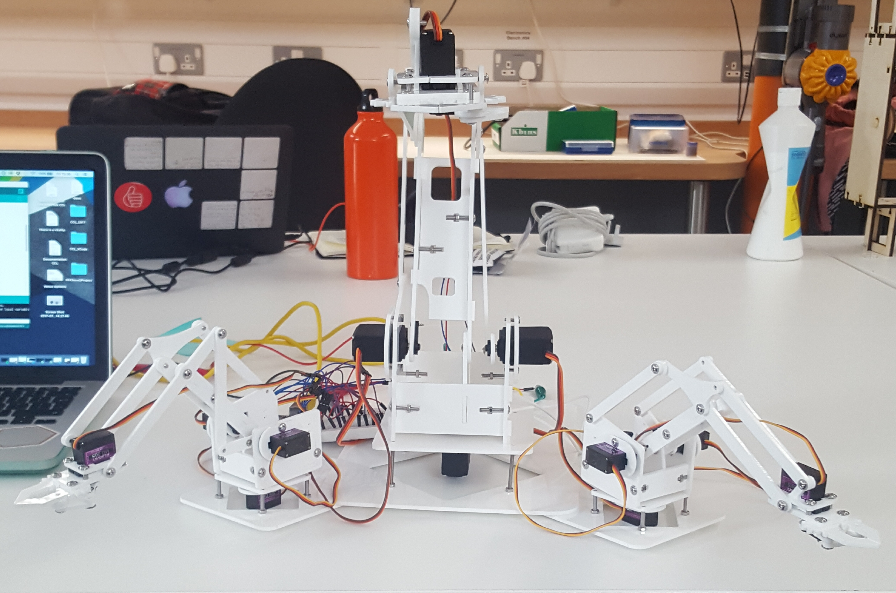

# Dancers In White Standing

A dance performance with both human and non-human performers. This piece explores the possibilities surrounding the involvement of non-human and non-anthropomorphic performers in live dance performance.

Bringing a set of three non-anthropomorphic autonoma together with a human dancer, Dancers in White, Standing focuses on the bold new forms of creativity and physical performance that result when art embraces computation and robotics. The otherness of such foreign bodies engaging with one another through dance presents a unique relationship that gives the improvised performance a truly genuine air of exploration. The work takes a firm and practical step toward a new intersection between dance performance and Artificial Intelligence.

Dancers in White, Standing avoids the anthropocentrism of replicating human motion in the non-human performers by instead using forms of motion that are pre-existing in non-human forms. The fragility and uncertainty of the robotic arm allows for explorations into movements that are markedly different from a human dancer. Responding to its fellow dancers in real-time, the improvised choreography allows each arm to demonstrate its own identity, as both a non-human entity and as a performer.

## Creating the Piece

### Important things to address

#### Building Object 

  - Designing Structure
The original design for the robotic arm structure came from the [MeArm](https://mime.co.uk/products/mearm/) and the first prototype that you see in this documentation (blue) is the exact original design. I didn't want to use just one arm and I felt strongly that it should be an odd number so as not to mimic the design of the human body. The final number settled on is three.

    - Acrylic

White

    - Plinth
    - Servos

4x MG995
8x MG90S

    - Microcontroller

Arduino Mega 2560

    - PowerSupply

    Useful forum thread with information about powering servos through mains/battery opposed to running through Arduno
    [Instructables - Using Arduino and 8 servos!? What type of power source?](http://www.instructables.com/answers/Using-Arduino-and-8-servos-What-type-of-power-so/)

#### Practice Based Research

It is important for me to take a practice as research approach to this project as this is how I have always worked in my own choreographic practice.
First steps working with a genetic algorithm I hoped to replicate the thought processes of a human dancer. The logic of GA's is very similar to that of an improvising dancer and I wanted to exploit this and to create data that could be used to manipulate my robotic arm.
What happened? I spent roughly one month implementing a trial algorithm that I could use as a proof of concept. You can see the results of that in this very short video here. The code can be viewed on this projects Github repository.

As you can see there is a huge amount of data (represented as points) when thinking abut mapping this data to the arm I would have to map it to movements of a much, much smaller range. This is problematic as the data would effectively become randomized eliminating the need for the algorithm.
Conclusion. I considered keeping the algorithm in place as I was particularly drawn to it conceptually however when thinking about audience reception I realized that the audience would not be able to see any connection between the human dancer and the arm. Without this connection I feel that it will be difficult for the audience to engage and so I decided that it was time to pursue a different approach.

1. Kinect
Data path - Kinect --> OFW --> Arduino --> Servo
Would need to convert from depth data to x, y and z coordinates
Have a play with processing --> Kinect1 examples, println data and see if can be sent across efficiently to Arduino library
Also think about Kinect in OpenFrameworks can I replicate the processing example? getWorldCoordinate() gives co-ordinates for depth point

[Nice article about using background subtraction based on color and depth data](https://www.ncbi.nlm.nih.gov/pmc/articles/PMC3758628/)

2. Accelerometer
Data path - Accelerometer --> Arduino --> Servo
Nice example code comes with Arduino library, in the Inverse Kinematics example would need to edit goToPoint(from accelerometer)
How do I get the data to Arduino wirelessly?

 

#### Testing

-Kinect depth transferred into real world coordinates
-Optical flow
-Colour tracking combined with background extraction for accuracy (only gives x, y coordinates. How can I get the z?)
-CV

#### Choreography

#### Stage Design/Exhibition Presentation

#### Costume Design

#### Conceptual/Theoretical Research

Dancers In White, Standing is the first practical exploration into what has previously been a largely theoretical research path into Artificial Intelligence (AI) and dance performance. I am Interested in exploring the non-human within dance performance and so decided to focus this project into finding a way to create a dance performance that included non-human performers.

A large challenge in creating a non-human performer is the audience. Often live performances rely on the audience’s ability to relate to the human performer and much of this relationship comes from shared sensory experiences. It is therefore natural that humans find it much harder to relate to non-human objects, an experience that is only intensified when the object is also a non-anthropomorphic.

To try and combat this my first instinct was to move away from a screen based performer. I felt that by giving something a physical form that exists in the same physical space as the human performer the audience would be more likely see it as an additional performer as opposed to set or decorative scenery.

#### Inventory

This inventory contains links to art works, design, ideas, and anything else that has been of significant influence for the creation of this piece.

[Zimoun](https://vimeo.com/7235817)

[Can Robots Dance](https://creators.vice.com/en_uk/article/d74zey/can-robots-dance)

[Pinokio](http://www.ben-dror.com/pinokio)

[Fabricating Performance](http://robohub.org/the-relationship-between-dance-and-robotic-fabrication-with-video/)

[Alexander McQueen](https://www.youtube.com/watch?v=VnA3XR5apQg)

[Madeline the Robot Tamer & Mimus](https://vimeo.com/191963552)

#### Bibliography

Birringer, J (1998) Media & Performance – Along the border, Baltimore:John Hopkins University Press. Pp. 105-145
Birringer, J.H. (2008) Performance, Technology, &amp; Science. New York (N.Y.): PAJ Publications

Bleeker, M. eds (2017) Transmission in Motion, New York: Routledge
Boden, M.A. (1992) The Philosophy of Artificial Intelligence. New York: Oxford University Press

Broadhurst, S. (2011) Digital Practices: Aesthetic and Neuroesthetic Approaches to Performance and Technology. Basingstoke: Palgrave Macmillan

Broadhurst, S. and Machon, J. (2011) Performance and Technology: Practices of Virtual Embodiment and Interactivity. Basingstoke: Palgrave Macmillan

DeLahunta, S and Shaw, N (2008) Choreographic Resources Agents, Archives, Scores and Installations, Performance Research,13:1,131-133

DeLahunta, S. (2013). Choreographic Ideas – Discourse from Practice, 1st ed., SHARE: Handbook for Artistic Research Education, ELIA: Amsterdam. pp. 170-177

Laumond, JP. and Abe, N. (2006). Dance Notations and Robot Motion, Switzerland: Springer

Laurel, B. (2014). Computers as Theatre. 2nd ed. Indiana: Pearson Education, Inc.

Leach, J. and deLahunta, S. (2015) Dance ‘Becoming’ Knowledge. Leonardo, volume In press.

Nollert, A. (2003) Performative Installation. Cologne: Snoeck

Popat, S. & Palmer, S. (2008) ‘Embodied Interfaces: Dancing with Digital Sprites’, Digital Creativity 19(2), pp.125-137. DOI 10.1080/14626260802037478

Popat, S. & Palmer, S. (2009) 'Dancing with Sprites and Robots: New Approaches to Collaboration between Dance and Digital Technologies’, in Butterworth, J. & Wildschut, L. (eds.) Contemporary Choreography: A Critical Reader, London: Routledge, pp.416-430

Popat, S. & Preece, K. (2012) ‘Pluralistic Presence: Practising Embodiment with my Avatar’, in Broadhurst S. & Machon J. (eds.) Identity, Performance and Technology: Practices of Empowerment, Embodiment and Technicity, Basingstoke: Palgrave Macmillan, pp.160-174

Salter, C (2010) Entangled: Technology and the Transformation of Performance. Massachusetts: MIT Press. Pp. 221-349

#### Other

[Sita Popat](https://www.youtube.com/watch?v=xDh4CMZVzvg)

http://roboticart.org/

[Robots and Art](http://roboticart.org/)

useful links for serial connection between openframeworks and Arduino

https://www.arduino.cc/en/Reference/ParseInt

http://forum.arduino.cc/index.php?topic=44055.0

https://www.cs.umd.edu/class/sum2003/cmsc311/Notes/Data/ascii.html

http://openframeworks.cc/documentation/communication/ofSerial/#show_writeByte

http://forum.arduino.cc/index.php?topic=44055.0

http://embedded.fm/blog/2017/6/15/sound-of-one-arm-tapping

http://forum.arduino.cc/index.php?topic=44055.0

