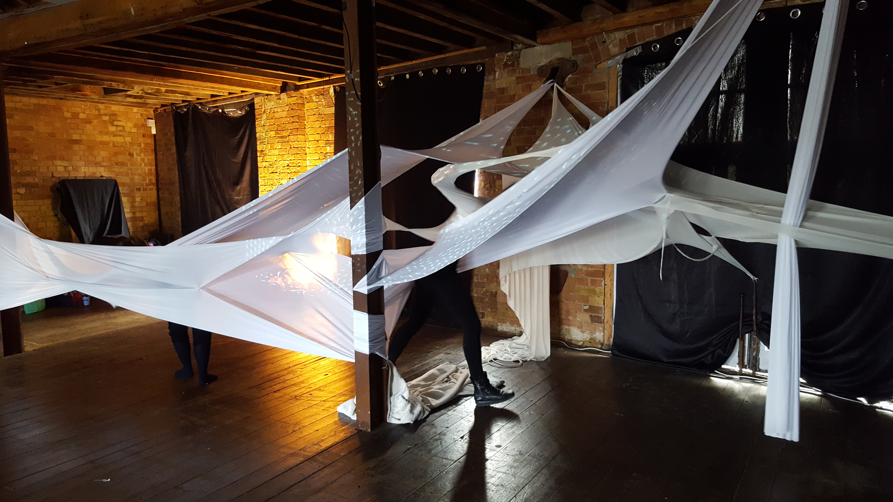
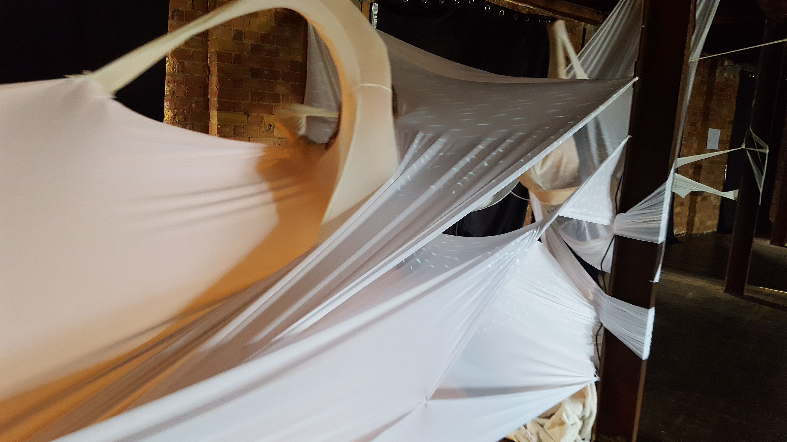
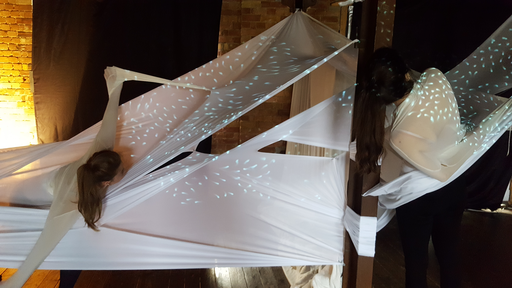
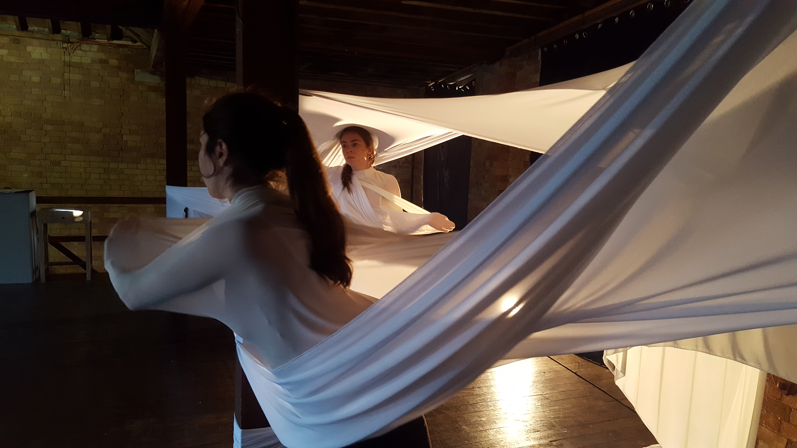
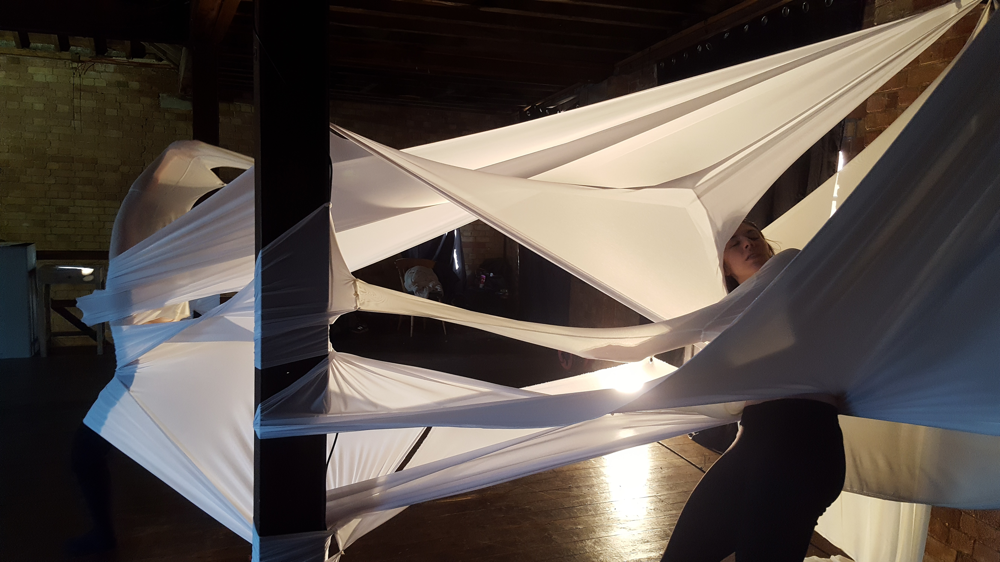
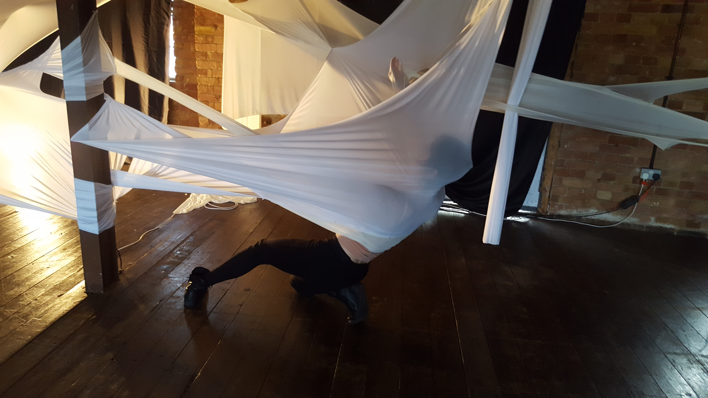
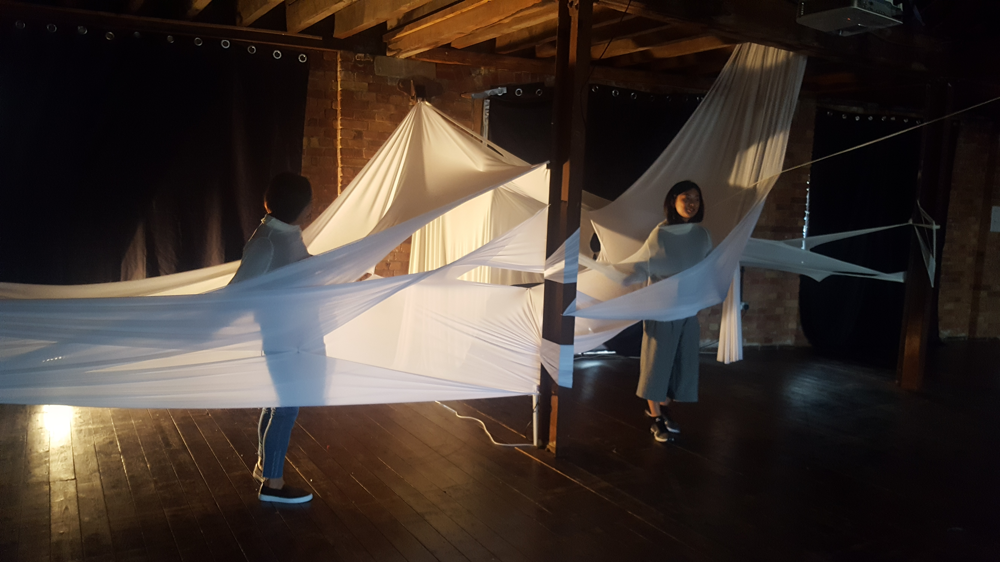

# Creative Process

This piece developed from an idea that came about at the [Creative Dance and Technology Lab](http://www.eastlondondance.org/projects/creative-dance-and-technology-lab-with-london-college-of-fashion/) 2017

Working in a small interdiciplinary group we discussed many ways of using each of our unique skills to make something for live performance. We had a mutual interest in making something very large, something that can both be used as costume and set. We wanted to experiment with restricting the performers movements. 

Conceptually we very quickly became interested in [Hypnic Jerk](https://en.wikipedia.org/wiki/Hypnic_jerk). There is a myth that says we get these hypnic jerks at the moment of drifting into sleep as our brain thinks we are dying and wants to send a jolt into the body to revive it. We were captured by the poetry of this myth. 

Estera developed the idea for the costume/set while I worked on the computational element. I wanted to make something that would respond to the dancers movement. The dancers were improvising and were instructed to have soft, mellow and flowing motions that are occasionally interrupted by sudden jerks or a significant change in dynamics. I used a lilypad and an accelorometer sewn into the fabric. The jerks in the motion were picked up by the accelorometer and used to trigger a change in the graphics. During the slower dream like motion the graphics show a soft blue particle swarm gliding around the space. During the jerkier motion this swarm was replaced by a flurry of red particles that bounced energetically. 

