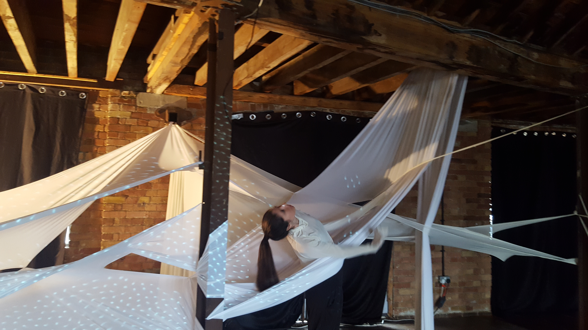

# In Between

[Creative Process](creativeProcess.md) 

A collaboration with <a href="http://www.esteraparker.com/" target="_blank"> Estera Parker </a> 

A hypnic jerk is understood as a miscommunication between the brain and consciousness. Involuntary twitches are seen as a result of electrical impulses sent by our brain to our body, often followed by the sensation of falling. It speaks of a struggle of control between body and mind.

This piece is an early exploration into the missing links in communication between body and mind. An abstract bed, becomes both costume and stage setting, a performative space for both performers and observers. 

