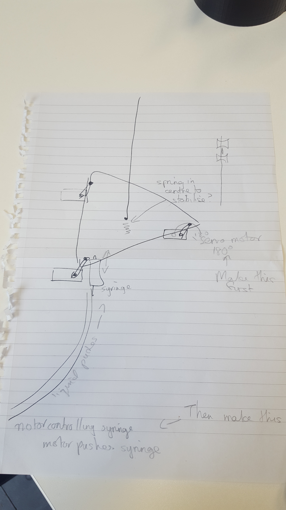
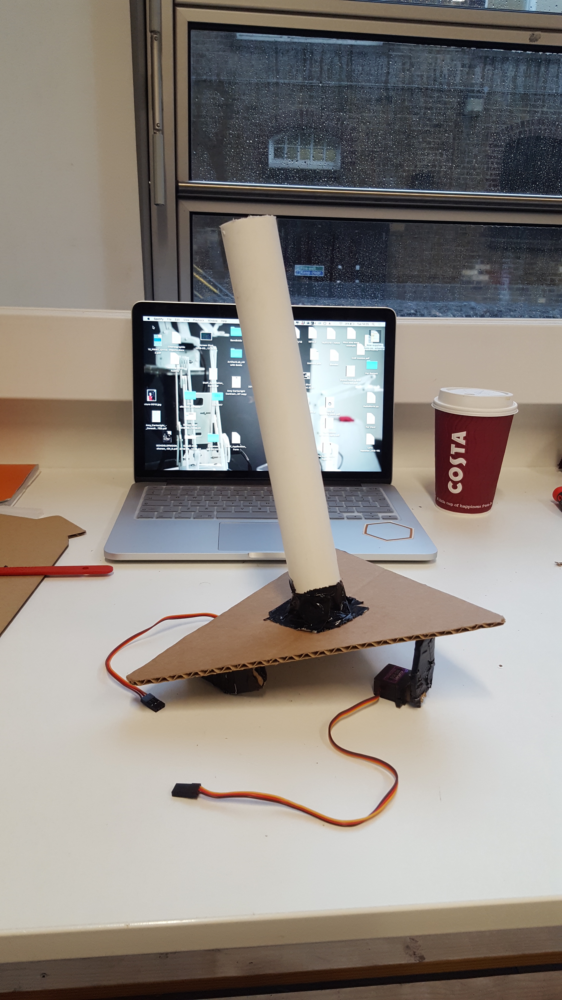
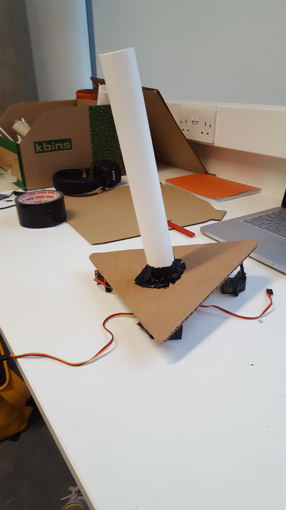

# Creative Process

Disclaimer - This piece is a work in progress, here you will find my research, discoveries, experiments and ramblings. This is not finished documentation but will form the basis of that once the piece has reached a conclusion. I will strive to keep it as detailed and current as possible but please forgive any gaps or non-sensical writing!

### Concept

My aim is to make a dance piece that continues explorations that I began in my previous piece "Dancers In White, Standing"(DIWS). My research centers around the possibility of giving non-human dancers agency in the performance space. This topic was touched upon in that piece and will be extended here by presenting a different robotic structure in a different performance setting.

In DIWS there were two main elements - Human Dancer and Non-Human Dancer. They related to each other, non-human dancer took movement data from the human dancer and the human dancer responded to the motions of the non-human dancer. A loop was created and both performers where responsible for the gradual real time build of the choreography. For this piece I would like to add an additional element. The non-human dancer will still take movement data from the human dancer but the human dancer will take influence from another source. Rather than creating a feedback loop this piece will operate more like a game of 'Chinese Whispers'.

The question I face here is what is this 'other source' that the human dancer will take influence from? This is something that requires a lot of consideration as ultimately the data taken from this source will drive the choreography of the entire piece. I would like to use archival footage of older dance works, perhaps works that are no longer being performed. The human dancer will respond to the footage and the non-human dancer will, in turn, respond to the human dancer. With each displacement the movement will move further from the original but a new work will be created. The final stepping stone of the chain will produce a piece performed by the non-human dancer which will act almost like a memory of the original footage. Altered and shifted over time but related non the less.  

As with DIWS I would like the movement of the human dancer in this piece to be improvised. Improvised movement allows for the unexpected. If the movement is choreographed the robots motion (which is dependent on data from the human dancer) will be the same in each performance. This unexpectedness allows for more agency.  

When thinking about the movement capabilities of my robotic performer I am attracted to the motion of <a href="https://en.wikipedia.org/wiki/Linear_actuator" target="_blank"> linear actuators </a> , as the motion of extension they have is not something that we see when observing movement in the human body. When we talk about movement and choreography we often refer to expanding the body into the space around us. A linear actuator physically expands into the space. I would like to experiment with this type of movement. Is it too abstract? Is there still allowance for the audience to look at it as a performer or is more familiar and relatable shape essential? Do we need to be able to relate to the motion of the mechanical performer in order for us to view it as a performer. These questions are difficult to answer at this stage but I think are worth further exploration.

 The software will make use of computer vision (CV). A camera will capture the human dancers movements which will be translated into location based data. This data will then be manipulated and set to the non-human dancer. Why is it so important to me to use computer vision? Explore the gap between using something like a potentiometer and computer vision. There is a difference. What is it? How can you show this? How can you demonstrate this? Open the crack wider. Using CV gives the non-human dancer a sense. They are able to see the human - dancer (in the same way that I can see a another dancer on the stage with me) they can collect data and interpret it into information that is useful for them. Exploring agency, when I use cv there is another person in the room with me. I can experiment and find out what works what doesn't, what is surprising. the agency coming from the physical can be faked. Fine line - sit just below it. The software can fill any gaps in agency - So how the robot respond to the human.

Does a non-human dancer need to be limited to the senses of a human dancer? Whoa big question!

How can I explore code each day while still allowing myself to explore movement?

 (Insert render of imagined set up)

 -----------------------------------------------------

### Early Experiments

#### Build

Cardboard prototype of a very simple <a href="https://www.mbtmag.com/article/2012/05/hydraulic-vs-electromechanical-actuators" target="_blank"> Electromechanical Actuator </a> 

<iframe width="560" height="315" src="https://www.youtube.com/embed/E1WnEYtShpk" frameborder="0" allow="autoplay; encrypted-media" allowfullscreen></iframe>

Next steps for this prototype will include constructing a more solid physical form using plastic tubing and 3D printing. I will then work on the software. Introducing CV and running a series of tests to see how the movement of the human can effect the movement of this very simple 'part'. And even more important what the effect is on the onlooker when watching this 'part' moving alongside a human body in a shared space.

First Prototype of Electromechanical Actuator using Computer Vision.

<iframe width="560" height="315" src="https://www.youtube.com/embed/NdsvM5-pilE" frameborder="0" allow="autoplay; encrypted-media" allowfullscreen></iframe>

This video shows a quick motion test using color tracking. The movement of the part is mapped to the movement of the hand along the x axis. When my hand extends through the space the piston physically extends into the space.

Following on from this initial build I felt that the range of motion of the part could be increased with some minor adaptations to the physical structure. Instead of connecting the moving lever to the outermost edge of the tube that moves I have connected it to the bottom edge. This allows th tube to extend much further into space. Problems with this build include an increased sense of instability as the tubes disconnect much easier. I think to solve this problem the tubes need to be longer.

I would also like to work on the aesthetic. Rather than a solid tube I would like to try 3D printing a mesh tubing design.  The design shown below has been created using a Voronoi diagram. I like the delicacy of this design which is influenced by the design of some modern day prosthetics.

#### Software Options

Color Tracking
I have used this technique before. It will allow me to track motion of one/several specific points on the body. Issues with this are that I do not want the tracking to be obvious. I don't want to pull the audience out of the state of watching the performance by highlighting how the robots are working. I feel very strongly that this will minimise overall perceptive agency. There are also issues with setup, when using color tracking the environment need to be very carefully setup with appropriate lighting. This is suitable if the piece will always be performed in a controlled environment but not ideal for the longevity of the piece.

Kinect
As I am working with abstract robotic forms I don't think using the Kinect skeleton tracking is necessary. There is no need to track the motion of the specific points of the human body. The Kinect has a lot of wiring which can be tricky and it has a very specific presence in the space. I would like to avoid the look of interactivity that comes with having a Kinect in the space.

Optical flow
Will allow the robot to look at the movement almost as if looking with blurry gaze. Able to see the directions of motion without looking at one specific body part. Given that the range of motion that the robot has is significantly reduced from that of the human dancer I think this is a good approach. It allows for a visual connection between the two without being to exact.

Machine Learning
????

### Later Experiments

I needed to start finalising the physical structure and so asked Daniele Mancini to come on board and help with the design and build. In our first meeting he was able to articulate my conceptual thoughts visually in Fusion.

This new structure is intended to be the bottom half only and demonstrates it's' movement capabilities. The addition of movement originating from the base of the structure creates a more visually pleasing type of motion. Before the non-human dancer would be supported by a static 'stand'. Now the stand become part of the non-human dancers body. The motion from this axis point would be subtle almost like it is swaying in the wind. Most of the motion would come from the 'crown' which would be positioned on top.

On thinking more about this new structure I realised that I was not so interested in the motion of the 'crown'. I felt that it was overly complex and potentially distracting. I decided to focus on the motion of the 'stand'. Creating a tall structure that sways with the motion of the dancer. I think that by simplifying the range and style of motion there is an opportunity to look into the detail of the motion and choose appropriate rules for motion for the non-human dancer.

The one with 3 legs may be too unstable. So I pursued the flat table option. Rather than using a square I have been advised to use a triangle with 3 servo motors, one at each point. Each of these will have a cam attached which will work by translating the rotational motion to linear motion allowing the triangle plane to tilt. See sketch below:

This sketch also shows an additional iteration which uses pneumonic controlled by syringes. This would solve the problem of the jittery motion that comes from using servo motors. The servo motors would be replaced by stepper motors, like the ones in floppy disk/CD drives. These motors would be used to push syringes which it will push liquid up towards a second syringe which would then tilt the flat plane.  

A first small scale prototype of the final design. This one currently uses servo motors. I would like to complete a working version of this before moving to the syringe. It may not be entirely necessary depending on how jittery the motors are.

-----------------------------------------------------

### Reading

[Movement Matters: How a Robot Becomes Body](http://delivery.acm.org/10.1145/3080000/3078035/a8-gemeinboeck.pdf?ip=158.223.165.48&id=3078035&acc=ACTIVE%20SERVICE&key=BF07A2EE685417C5%2E18BBEBD7797679F3%2E4D4702B0C3E38B35%2E4D4702B0C3E38B35&__acm__=1520335565_d4833361ae449f68b58db8b9cc764783)

[Capturing and Documenting Creative Processes in
 Contemporary Dance](http://delivery.acm.org/10.1145/3080000/3078041/a7-ribeiro.pdf?ip=158.223.165.48&id=3078041&acc=OA&key=BF07A2EE685417C5%2E18BBEBD7797679F3%2E4D4702B0C3E38B35%2E636B648B25476672&__acm__=1520336034_62d61ada870fde8b47518fe244021c82)

[The Delay Mirror: a Technical Innovation Specific to the Dance Studio](http://delivery.acm.org/10.1145/3080000/3078033/a9-molina-tanco.pdf?ip=158.223.165.48&id=3078033&acc=ACTIVE%20SERVICE&key=BF07A2EE685417C5%2E18BBEBD7797679F3%2E4D4702B0C3E38B35%2E4D4702B0C3E38B35&__acm__=1520336095_2c86d3a511880a43fbde45cd3c2c0d18)

[Sentimental Soft Robotics as Companion Artifacts](http://moco17.movementcomputing.org/wp-content/uploads/2017/12/ds9-zheng.pdf)

[Kinetic predictors of spectators’ segmentation of a live dance
 performance](http://moco17.movementcomputing.org/wp-content/uploads/2017/12/poster2-Forger.pdf)

[Algorithmic Reflections of Choreography](http://humantechnology.jyu.fi/archive/vol-12/issue-2/algorithmic-reflections-on-choreography/@@display-file/fullPaper/Ventura_Bisig.pdf)

[Leveraging morphological computation for expressive movement
 generation in a soft robotic artwork](http://delivery.acm.org/10.1145/3080000/3078029/a20-jorgensen.pdf?ip=86.172.150.17&id=3078029&acc=ACTIVE%20SERVICE&key=BF07A2EE685417C5%2E18BBEBD7797679F3%2E4D4702B0C3E38B35%2E4D4702B0C3E38B35&__acm__=1520368645_adca975fea6ea08a8063c36dfeda5a6e)

-----------------------------------------------------

### Resources

[Erwin Wurm](http://www.erwinwurm.at/artworks.html)

[Cyrus Kabiru](https://smacgallery.com/artist/cyrus-kabiru-2/)

[Oscar Schlemmers Ballet of Geometry](https://www.theguardian.com/artanddesign/gallery/2016/nov/24/oskar-schlemmers-ballet-of-geometry-in-pictures)

[Open Ended Group - work with choreography and code](http://openendedgroup.com/index.html)

[Marc Downie Thesis - Choreographing the Extended Agent: performance graphics for dance theater] (http://openendedgroup.com/writings/downieThesis.html)

[What its like to be a robot - Ted Talk + Written speech](https://www.ted.com/talks/leila_takayama_what_s_it_like_to_be_a_robot/transcript?ref=hvper.com)

[Caroline Liebl](http://www.carolinliebl.de/vincent-und-emily)

[Goodbye Uncanny Valley - Alan Warburton](https://vimeo.com/237568588)

[Undercurrents - Albert Omass](https://omoss.io/work/undercurrents)

[Design Kit - Useful for ideation and planning of a project](http://www.designkit.org/methods/60)

[Gibson and Martelli latest research proposal](http://gtr.rcuk.ac.uk/projects?ref=AH%2FR009368%2F1)

[Zach Liberman talks about his artistic practice](https://vimeo.com/232656895)

[Neural Magazine](http://neural.it/)

[Eric Min Hcuong Castaing](http://shonen.info/)

[Motion House Charge](https://charge.motionhouse.co.uk/)

[Merging Dance, Robotics and AI](http://this.deakin.edu.au/innovation/one-creative-team-merging-dance-robotics-and-ai)

[Pinoke](http://motionlab.deakin.edu.au/portfolio/thepinokeproject/?_ga=2.52499240.1815394856.1520368039-1585838154.1520368039)

[Robot made using linear actuators](https://www.youtube.com/watch?v=H14O47a2E88)

[How to stick form lab prints together](https://formlabs.com/blog/how-to-create-models-larger-than-your-3d-printers-build-volume/0)

[Formlab tech specs](https://formlabs.com/3d-printers/form-2/tech-specs/)

[Making 3D Voronoi Model in Meshmixer](http://www.instructables.com/id/Make-Voronoi-Pattern-with-Autodesk-Meshmixer/);

[Useful blog on using Osc in processing](http://www.technopagan.net/blog/tech/processing-osc/)

[Design inspo](https://www.youtube.com/watch?v=HSKyHmjyrkA)

[Video Documentation, Kasseler Kunstverein, 2016
 Rechnender Raum Installation views, 2007-2016
 RECHNENDER RAUM](http://www.rlfbckr.org/work/rechnender-raum/)

[Micro Linear Servo](https://www.banggood.com/1-Pair-Goteck-GS-1502-1_5g-Analog-Micro-Servo-For-RC-Airplane-p-1112821.html?gmcCountry=GB&currency=GBP&createTmp=1&utm_source=googleshopping&utm_medium=cpc_ods&utm_content=heath&utm_campaign=pla-airplane-gb-pc&gclid=Cj0KCQjw5-TXBRCHARIsANLixNyzazsyioO1k1aq7U8_GET6chl2uAQVx7vNyPh5TKSgLasZT63hwVEaAtNDEALw_wcB&cur_warehouse=CN)

[Tilt Mechanism](https://www.youtube.com/watch?v=8IeUBrCl1D8)

[507 Mechanical motions](http://507movements.com/index56.html)

[cam](https://en.wikipedia.org/wiki/Cam)

[hydraulic robotic arm](https://www.google.co.uk/search?q=hydraulic+robotic+arm+kit&source=lnms&tbm=isch&sa=X&ved=0ahUKEwja0fGz36rbAhVhJJoKHX80CuwQ_AUIDCgD&biw=1279&bih=699#imgrc=yNpSY3Sfs21cSM:)

[CD Rom Stepper Motor with Arduino](http://electronics-diy.com/driving-cdrom-stepper-motor-with-arduino.php)

[Robotic Tentacle](https://hackaday.com/2016/10/05/two-stage-tentacle-mechanisms-part-ii-the-cable-controller/)

-----------------------------------------------------

## Notes (Dumping Ground)

### Feedback sessions

_10/01/18_
First session rough notes following discussion with tutor and peers

_17/01/18_
Preliminary thoughts - notes in image below taken by tutor

_24/02/18_
How to use blogging and writing to accompany your artistic practice

[Writing Task](writingTask.md)

_07/02/18_
Brief notes detailing discussions

_21/02/18_
Specific details - notes in image below taken by tutor

Thoughts about the title of the piece: Audrey

Audrey works as both the name of the non-human dancer and the name of the piece as a whole. It is inspired by:

'Audrey Munson' - who was the model for a huge amount of the statues in NYC. She is the face that gives agency to so many fictuous, religious and historical figures. "Audrey Munson, whose likeness can be found throughout Manhattan publicly representing consummate concepts like freedom, purity, peace and truth, ranked among the most sought-after muses for painters and sculptors for the first quarter of the twentieth century." "[Wiki](https://en.wikipedia.org/wiki/Audrey_Munson)

'Queen of the artists studios'  - Andrea Geyer

Vocabulary: Robot, Non-Human dancer, Non-human performer,

### CCL / Sensorium 2018

Anthromorphism when working with non-human forms - Mapping between two extremely different bodies. Remove politics and preconception by making robots non-human looking.

#### Machine Learning
[Toby K](http://www.tobyk.com.au/)

Machine Learning does not require language --> we let the machine figure out the steps needed to solve the task.

* Classification Task
* Generative Task

Different types of machine learning algorithms

* Neural Networks
* T-SNE - Unsupervised
* K Nearest Neighbors
* Diffusion Map
* Error driven learning

Machine learning is not inherently connected to AI

Be careful of language used. Machine learning does not mean machine understanding. i.e. Just because a machine responds to emotion does not mean it understands that emotion.

#### Maria Judova

[Website](http://mariajudova.net/)

How do we capture a moving body?
Communication between dancer and non-dancer.

Impact can be created with simplicity --> too much input can be overkill

Dance will always have noise. We need to filer this noise when working with computational elements but bow can it be filtered without loosing meaning?

Mental image of movement is different from an actual movement.

Boundaries between real and virtual.

Generative footage vs found footage

'Dust' - Not only VR as the user us able to see themselves in the surroundings they are currently in. The real world existing in the virtual that can be manipulated.

Alphabet Box/Cube - Trisha Brown.

#### Mio Sinclair
[Waltz Binaire](http://waltzbinaire.com/)

Kandinsky - Point --> Line --> Plane. Can this be used as a way to communicate dance?

What do you do when it stops working is there a contract for this?

Most important WHY --> Why does the tech exist in the piece?
                   --> Why am I making this work?

How do we perceive dance?

Actors moved to TV, musicians moved to Radio, Dance refused to fit through a cable. --> This is the beauty of dance. Is it the intention of the dancer that doesn't fit through the cable?

Modern Dance is a technology a technology that Pina Bauch used to make 'The Rite of Spring' which is the grounding of dance. It pulled dance back into the earth and completed the story of modern dance. Any modern dance made after this piece is seen as cheesy because it has already been peaked.

Old German Law --> Humans are defined as creatures that see themselves.

#### Ka Fai Choi
[Website](http://www.ka5.info/)

Muscle stimulation using electricity

Alan Lomax Film - [Dance and Human History](https://www.youtube.com/watch?v=MOsZhZIQ-6Q)

What are the choreographic minds of future dancers?

What do we think about when we think about dance?

Using renders to show a hypothetical work --> this allows the art work to exist even before it can exist in real life. Allows the artist to work with technologies that are not yet invented or not advanced enough for purpose. Allows the artist to explore avenues that seem unobtainable in reality .

#### Joshua Nobel

Designing less real

Design is an anti discipline --> there are no values

Elliot Montgomery --> [unreserved mapping of speculative design](https://www.google.co.uk/search?q=eliot+montgomery+-+mapping+of+speculative+design&source=lnms&tbm=isch&sa=X&ved=0ahUKEwjQhrmK8P3aAhWHRMAKHd8MDQYQ_AUICigB&biw=1211&bih=699#imgrc=37N-MZ-rRmB5SM:)

Anthropology not fiction

Minimum Viable Reality

Free yourself from what you can build --> you can make more real things with less real things.

The tool is just the tool,not the artwork or the design. It is a step towards giving understanding to the art/design.

#### Jessica In

Stuart Brand - Pace Layering

Lucinda Childs - choreographic notation

How can you visualize things that are not seen?

Anthropmorphising geometric shapes
[Norman McLaren](https://en.wikipedia.org/wiki/Norman_McLaren)

#### Alexander Scholz
[Website](http://www.creativeapplications.net/)

[Holo Magazine](http://holo-magazine.com/1/)

READ - [System Aesthetics](https://monoskop.org/images/0/03/Burnham_Jack_1968_Systems_Esthetics_Artforum.pdf)
[other info](http://www.tate.org.uk/research/publications/tate-papers/05/all-systems-go-recovering-jack-burnhams-systems-aesthetics)

Artists in this field often have difficulties identifying what we do.

Parachute somewhere --> Explore the possibilities --> Go beyond the horizon.

Things that are not computable cant exist.
Things that are not computable are becoming strange and are ceasing to exist,

Florian Kramer - [Transmediale Publication](https://transmediale.de/archive/publications?f%5B0%5D=field_year%3A38)

#### Andrej Boleslavski
[Website](http://id144.org/)
 Physicality to Virtual Media

Choreographic objects. Objects that guide movement through the space.

All digital art is performance. They have the same problem of limited life space as live performance as the tech used becomes obsolete very fast.

Github id144

#### Joachim Sauter
[Website](http://www.joachimsauter.com/)

The infusion of physical into digital world

Poetry of motion

Phygital
Postvirtual
Neophysical
Postdigital

artcom.de

#### Extra notes

Caroline Liebl

Jeanne - All technology has agency when put on a stage. How do we deal with this?

### People to talk to

* Guido Orgs - CONTACTED
* Toby Beasley - DONE
* Eric Min Hcong Castaing 
* Hanna Wrobl - CONTACTED
