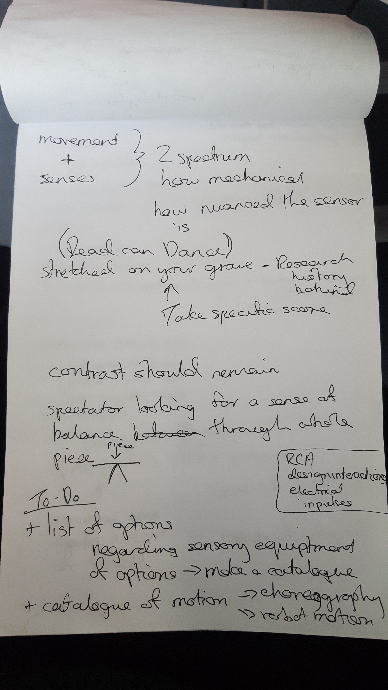

# Creative Process

### Early Experiments

Cardboard prototype of a very simple <a href="https://www.mbtmag.com/article/2012/05/hydraulic-vs-electromechanical-actuators" target="_blank"> Electromechanical Actuator </a> 

<iframe width="640" height="360" src="ttp://img.youtube.com/vi/E1WnEYtShpk/0.jpg" frameborder="0" allow="autoplay; encrypted-media" allowfullscreen></iframe>

I am attracted to the motion of <a href="https://en.wikipedia.org/wiki/Linear_actuator" target="_blank"> linear actuators </a> , as the motion of extension they have is not something that we see when observing movement in the human body. When we talk about movement and choreography we often refer to expanding the body into the space around us. A linear actuator physically expands into the space. Making a simple prototype of this type of movement will allow me to explore the possibilities around using this type of mechanical  movement in performance. Is it too abstract? Is there still allowance for the audience to look at it as a performer or is a familiarity of movement essential? Do we need to be able to relate to the motion of the mechanical performer in order for us to view it as a performer.

These questions are difficult to answer at this stage but I think are worth further exploration. Next steps for this prototype will include constructing a more solid physical form using plastic tubing and 3D printing. I will then work on the software. Introducing CV and running a series of tests to see how the movement of the human can effect the movement of this very simple 'part'. And even more important what the effect is on the onlooker when watching this 'part' moving alongside a human body in a shared space.

Does a non-human dancer need to be limited to the senses of a human dancer? Whoa big question!

### Feedback sessions

_10/01/18_
First session rough notes following discussion with tutor and peers

_17/01/18_
Preliminary thoughts - notes in image below taken by tutor

_24/02/18_
How to use blogging and writing to accompany your artistic practice

[Writing Task](writingTask.md)

_07/02/18_
Brief notes detailing discussions

_21/02/18_
Specific details - notes in image below taken by tutor

Why is it so important to me to use computer vision to control my prototypes? Explore the gap between using something like a potentiometer and computer vision. There is a difference. What is it? How can you show this? How can you demonstrate this? Open the crack wider. Exploring agency, when i use cv there is another person in the room with me. I can experiment and find out what works what doesn't, what is surprising. the agency coming from the physical can be faked. Fine line - sit just below it. The software can fill any gaps in agency - So how the robot respond to the human.

### Reading

[Movement Matters: How a Robot Becomes Body](http://delivery.acm.org/10.1145/3080000/3078035/a8-gemeinboeck.pdf?ip=158.223.165.48&id=3078035&acc=ACTIVE%20SERVICE&key=BF07A2EE685417C5%2E18BBEBD7797679F3%2E4D4702B0C3E38B35%2E4D4702B0C3E38B35&__acm__=1520335565_d4833361ae449f68b58db8b9cc764783)

[Capturing and Documenting Creative Processes in
 Contemporary Dance](http://delivery.acm.org/10.1145/3080000/3078041/a7-ribeiro.pdf?ip=158.223.165.48&id=3078041&acc=OA&key=BF07A2EE685417C5%2E18BBEBD7797679F3%2E4D4702B0C3E38B35%2E636B648B25476672&__acm__=1520336034_62d61ada870fde8b47518fe244021c82)

[The Delay Mirror: a Technical Innovation Specific to the Dance Studio](http://delivery.acm.org/10.1145/3080000/3078033/a9-molina-tanco.pdf?ip=158.223.165.48&id=3078033&acc=ACTIVE%20SERVICE&key=BF07A2EE685417C5%2E18BBEBD7797679F3%2E4D4702B0C3E38B35%2E4D4702B0C3E38B35&__acm__=1520336095_2c86d3a511880a43fbde45cd3c2c0d18)

[Sentimental Soft Robotics as Companion Artefacts](http://moco17.movementcomputing.org/wp-content/uploads/2017/12/ds9-zheng.pdf)

[Kinetic predictors of spectators’ segmentation of a live dance
 performance] (http://moco17.movementcomputing.org/wp-content/uploads/2017/12/poster2-Forger.pdf)

[Algorythmic Reflections of Choreography](http://humantechnology.jyu.fi/archive/vol-12/issue-2/algorithmic-reflections-on-choreography/@@display-file/fullPaper/Ventura_Bisig.pdf)

[Leveraging morphological computation for expressive movement
 generation in a soft robotic artwork](http://delivery.acm.org/10.1145/3080000/3078029/a20-jorgensen.pdf?ip=86.172.150.17&id=3078029&acc=ACTIVE%20SERVICE&key=BF07A2EE685417C5%2E18BBEBD7797679F3%2E4D4702B0C3E38B35%2E4D4702B0C3E38B35&__acm__=1520368645_adca975fea6ea08a8063c36dfeda5a6e)

### Resources

[Erwin Wurm](http://www.erwinwurm.at/artworks.html)

[Cyrus Kabiru](https://smacgallery.com/artist/cyrus-kabiru-2/)

[Oscar Schlemmers Ballet of Geometry] (https://www.theguardian.com/artanddesign/gallery/2016/nov/24/oskar-schlemmers-ballet-of-geometry-in-pictures)

[Open Ended Group - work with choreography and code] (http://openendedgroup.com/index.html)

[Marc Downie Thesis - Choreographing the Extended Agent: performance graphics for dance theater] (http://openendedgroup.com/writings/downieThesis.html)

[What its like to be a robot - Ted Talk + Written speech](https://www.ted.com/talks/leila_takayama_what_s_it_like_to_be_a_robot/transcript?ref=hvper.com)

[Goodbye Uncanny Valley - Alan Warburton](https://vimeo.com/237568588)

[Undercurrents - Albert Omass](https://omoss.io/work/undercurrents)

[Design Kit - Useful for ideation and planning of a project](http://www.designkit.org/methods/60)

[Gibson and Martelli latest research proposal](http://gtr.rcuk.ac.uk/projects?ref=AH%2FR009368%2F1)

[Zach Liberman talks about his artistic practice](https://vimeo.com/232656895)

[Neural Magazine](http://neural.it/)

[Eric Min Hcuong Castaing](http://shonen.info/)

[Motion House Charge](https://charge.motionhouse.co.uk/)

[Merging Dance, Rootics and AI](http://this.deakin.edu.au/innovation/one-creative-team-merging-dance-robotics-and-ai)

[Pinoke](http://motionlab.deakin.edu.au/portfolio/thepinokeproject/?_ga=2.52499240.1815394856.1520368039-1585838154.1520368039)

### People to talk to

* Guido Orgs
* Toby Beasley
* Eric Min Hcong Castaing
