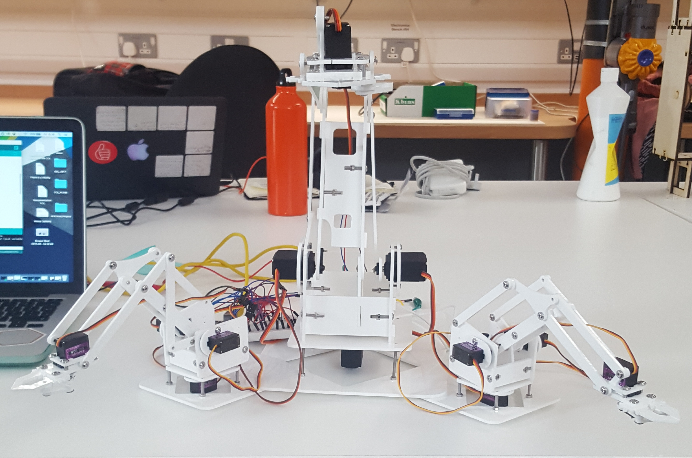
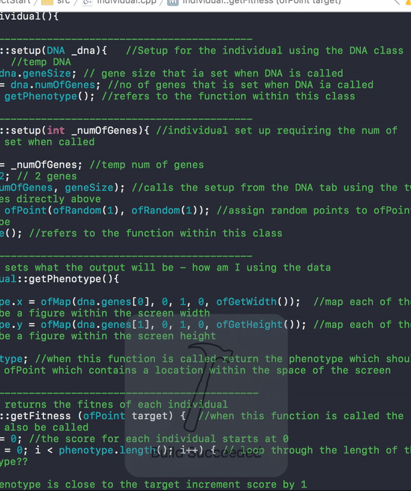
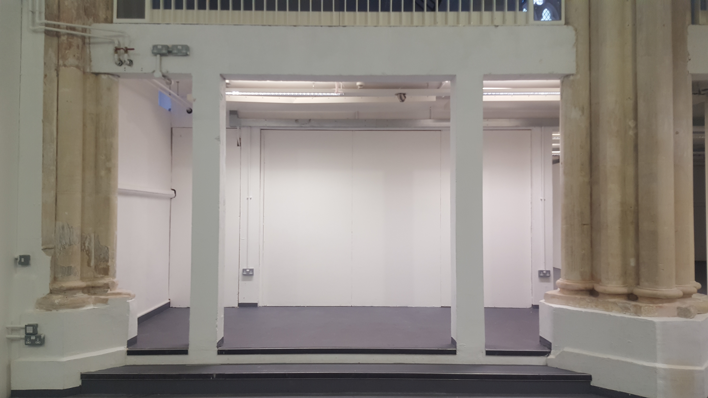

# The Situation of the Robot and the Dancer

'Before I go out on the stage, I must place a motor in my soul. When that begins to work my legs and arms and my whole body will move independently of my will. But if I do not get time to put that motor in my soul, I cannot dance' (Isadora Duncan 1995)

I am interested in exploring the relationships between human and non-human performers in live dance performance. Is it possible for a non-anthropomorphic mechanical object to portray a real performable relationship within live performance.

This project will play on the human tendency to add human characteristics to non-human objects. Using this tendency to explore the possibility of a non-human dance performer. This project is the first stages of a wider exploration into dance performance and Artificial Intelligence.

### Important things to address

#### Building Object

  - Designing Structure
The original design for the robotic arm structure came from the [MeArm](https://mime.co.uk/products/mearm/) and the first prototype that you see in this documentation (blue) is the exact original design. I didn't want to use just one arm and I felt strongly that it should be an odd number so as not to mimic the design of the human body. The final number settled on is three.

    - Acrylic

White

    - Plinth
    - Servos

4x MG995
8x MG90S

    - Microcontroller

Arduino Mega 2560

    - PowerSupply

    Useful forum thread with information about powering servos through mains/battery opposed to running through Arduno
    [Instructables - Using Arduino and 8 servos!? What type of power source?](http://www.instructables.com/answers/Using-Arduino-and-8-servos-What-type-of-power-so/)
    http://www.instructables.com/answers/Using-Arduino-and-8-servos-What-type-of-power-so/

#### Practice Based Research

It is important for me to take a practice as research approach to this project as this is how I have always worked in my own choreographic practice.
First steps working with a genetic algorithm I hoped to replicate the thought processes of a human dancer. The logic of GA's is very similar to that of an improvising dancer and I wanted to exploit this and to create data that could be used to manipulate my robotic arm.
What happened? I spent roughly one month implementing a trial algorithm that I could use as a proof of concept. You can see the results of that in this very short video here. The code can be viewed on this projects Github repository.

As you can see there is a huge amount of data (represented as points) when thinking abut mapping this data to the arm I would have to map it to movements of a much, much smaller range. This is problematic as the data would effectively become randomized eliminating the need for the algorithm.
Conclusion. I considered keeping the algorithm in place as I was particularly drawn to it conceptually however when thinking about audience reception I realized that the audience would not be able to see any connection between the human dancer and the arm. Without this connection I feel that it will be difficult for the audience to engage and so I decided that it was time to pursue a different approach.

1. Kinect
Data path - Kinect --> OFW --> Arduino --> Servo
Would need to convert from depth data to x, y and z coordinates
Have a play with processing --> Kinect1 examples, println data and see if can be sent across efficiently to Arduino library
Also think about Kinect in OpenFrameworks can I replicate the processing example? getWorldCoordinate() gives co-ordinates for depth point

2. Accelerometer
Data path - Accelerometer --> Arduino --> Servo
Nice example code comes with Arduino library, in the Inverse Kinematics example would need to edit goToPoint(from accelerometer)
How do I get the data to Arduino wirelessly?

 

#### Testing

-Kinect depth transferred into real world coordinates
-Optical flow
-Colour tracking combined with background extraction for accuracy (only gives x, y coordinates. How can I get the z?)
-CV

#### Choreography

#### Stage Design/Exhibition Presentation

#### Costume Design

#### Conceptual/Theoretical Research

Need to copy over from handwritten notes

Sita Papat - connection between operator and performer

#### Inventory

This inventory contains links to art works, design, ideas, and anything else that has been of significant influence for the creation of this piece.

[Zimoun](https://vimeo.com/7235817)

[Can Robots Dance](https://creators.vice.com/en_uk/article/d74zey/can-robots-dance)

[Pinokio](http://www.ben-dror.com/pinokio)

[Fabricating Performance](http://robohub.org/the-relationship-between-dance-and-robotic-fabrication-with-video/)

[Alexander McQueen](https://www.youtube.com/watch?v=VnA3XR5apQg)

[Madeline the Robot Tamer & Mimus](https://vimeo.com/191963552)

#### Bibliography

Dance Notations and Robot Motion

Computers as Theatre

**DeLahunta Scott** Dance Becoming Knowledge

**DeLahunta Scott** Choreographic Ideas – Discourse from Practice

The choreographic-language-agent

Choreographic Resources Agents

A Conversation about choreographic thinking tools

Performance and Technology: Practices of Virtual Embodiment and Interactivity

Entangled: Technology and the Transformation of Performance

The philosophy of artificial intelligence

Transmission in Motion

The Improvisation Game

Media & Performance – Along the border

Performative Installation

Performance and Technology

Digital Practices – Aesthetic and Neuroesthetic Approaches to Performance and Technology

Performance, Technology and Science

Entangled – Technology and the transformation or performance

Digital Movement

**Popat, S. & Preece, K. (2012)** `Pluralistic Presence: Practising Embodiment with my Avatar', in Broadhurst S. & Machon J. (eds.) Identity, Performance and Technology: Practices of Empowerment, Embodiment and Technicity, Basingstoke: Palgrave Macmillan, pp.160-174

**Popat, S. & Palmer, S. (2009)** `Dancing with Sprites and Robots: New Approaches to Collaboration between Dance and Digital Technologies', in Butterworth, J. & Wildschut, L. (eds.) Contemporary Choreography: A Critical Reader, London: Routledge, pp.416-430

**Popat, S. & Palmer, S. (2008)** 'Embodied Interfaces: Dancing with Digital Sprites', Digital Creativity 19(2), pp.125-137. DOI 10.1080/14626260802037478

[Sita Popat](https://www.youtube.com/watch?v=xDh4CMZVzvg)

http://roboticart.org/

[Robots and Art](http://roboticart.org/)
