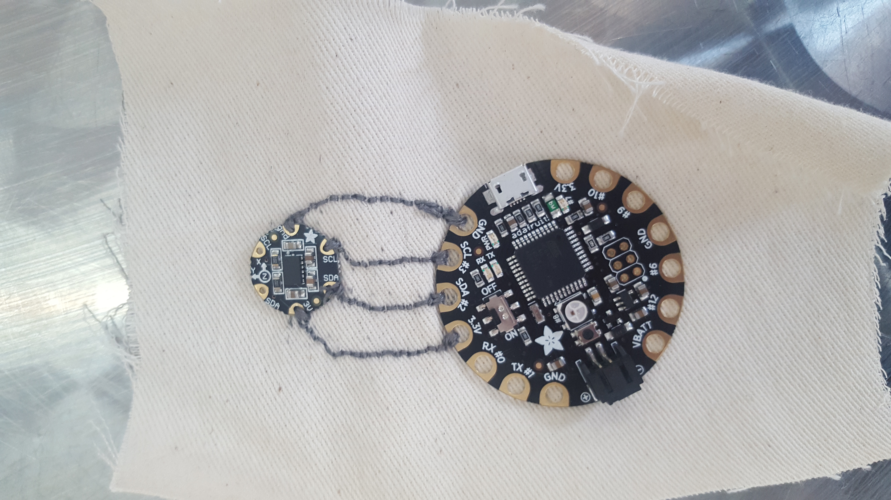
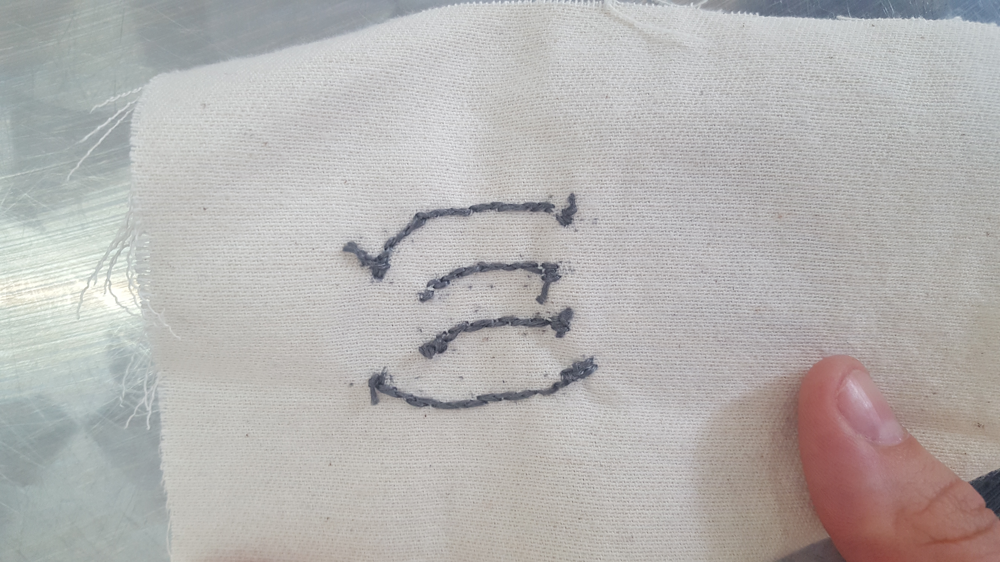
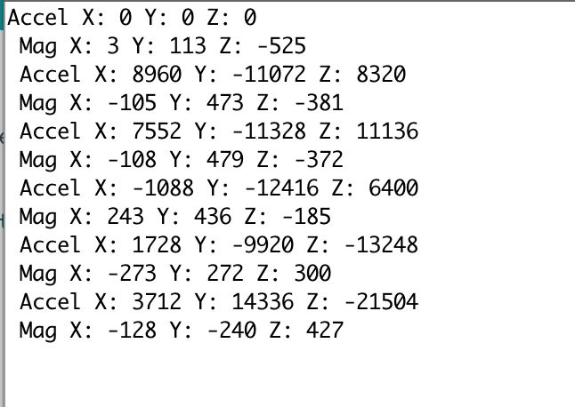
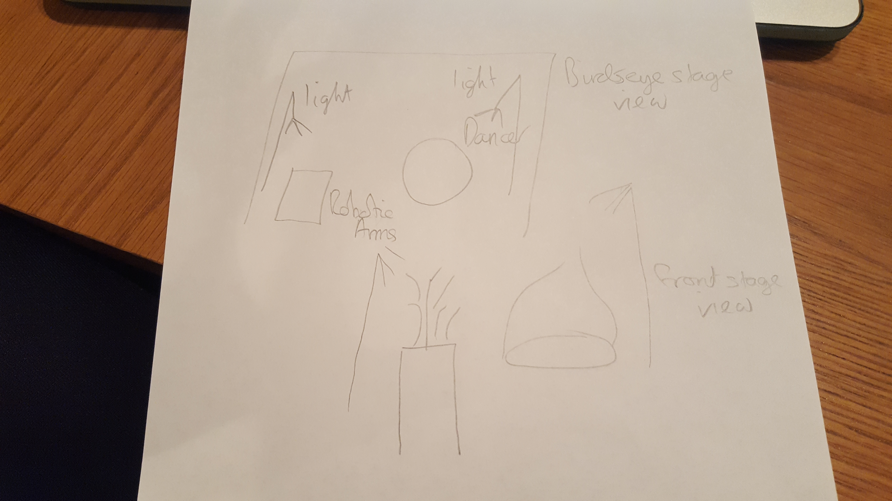
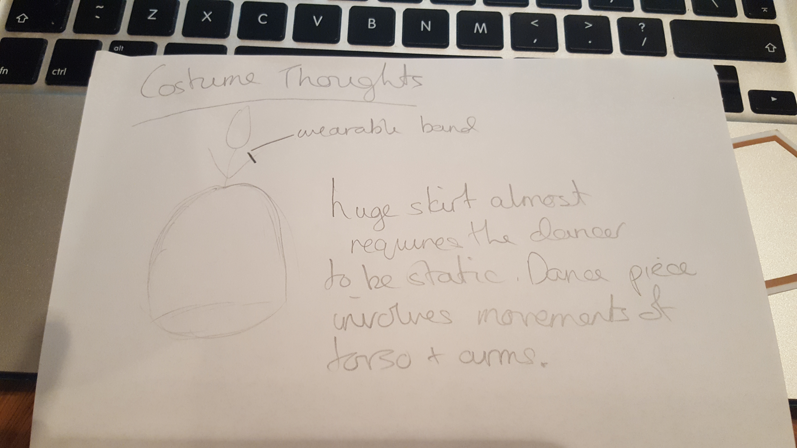

# The Situation of the Robot and the Dancer

'Before I go out on the stage, I must place a motor in my soul. When that begins to work my legs and arms and my whole body will move independently of my will. But if I do not get time to put that motor in my soul, I cannot dance' (Isadora Duncan 1995)

I am interested in exploring the relationships between human and non-human performers in live dance performance. Is it possible for a non-anthropomorphic mechanical object to portray a real performable relationship within live performance.

This project will play on the human tendency to add human characteristics to non-human objects. Using this tendency to explore the possibility of a non-human dance performer. This project is the first stages of a wider exploration into dance performance and Artificial Intelligence.

### Important things to address

#### Timeline
#### Building Object
  - Designing Structure
  - Ordering Parts
    - Acrylic
    - Plinth
    - Servos
    - Screws
    - PowerSupply
    - Conductive thread
#### Inputs

1. Kinect
Data path - Kinect --> OFW --> Arduino --> Servo
Would need to convert from depth data to x, y and z coordinates
Have a play with processing --> Kinect1 examples, println data and see if can be sent across efficiently to Arduino library
Also think about Kinect in OpenFrameworks can I replicate the processing example? getWorldCoordinate() gives co-ordinates for depth point

2. Accelerometer
Data path - Accelerometer --> Arduino --> Servo
Nice example code comes with Arduino library, in the Inverse Kinematics example would need to edit goToPoint(from accelerometer)
How do I get the data to Arduino wirelessly?

 

#### Testing

-Kinect depth transferred into real world coordinates
-Optical flow
-Colour tracking combined with background extraction for accuracy (only gives x, y coordinates. How can I get the z?)
-CV

#### Choreography
#### Stage Design/Exhibition Presentation

#### Costume Design

#### Research
Sita Papat - connection between operator and performer

#### Inventory
[Zimoun](https://vimeo.com/7235817)

[Can Robots Dance](https://creators.vice.com/en_uk/article/d74zey/can-robots-dance)

[Pinokio](http://www.ben-dror.com/pinokio)

[Fabricating Performance](http://robohub.org/the-relationship-between-dance-and-robotic-fabrication-with-video/)

[Alexander McQueen](https://www.youtube.com/watch?v=VnA3XR5apQg)

[Madeline the Robot Tamer & Mimus](https://vimeo.com/191963552)

#### Bibliography

Dance Notations and Robot Motion

Computers as Theatre

**DeLahunta Scott** Dance Becoming Knowledge

**DeLahunta Scott** Choreographic Ideas – Discourse from Practice

The choreographic-language-agent

Choreographic Resources Agents

A Conversation about choreographic thinking tools

Performance and Technology: Practices of Virtual Embodiment and Interactivity

Entangled: Technology and the Transformation of Performance

The philosophy of artificial intelligence

Transmission in Motion

The Improvisation Game

Media & Performance – Along the border

Performative Installation

Performance and Technology

Digital Practices – Aesthetic and Neuroesthetic Approaches to Performance and Technology

Performance, Technology and Science

Entangled – Technology and the transformation or performance

Digital Movement

**Popat, S. & Preece, K. (2012)** `Pluralistic Presence: Practising Embodiment with my Avatar', in Broadhurst S. & Machon J. (eds.) Identity, Performance and Technology: Practices of Empowerment, Embodiment and Technicity, Basingstoke: Palgrave Macmillan, pp.160-174

**Popat, S. & Palmer, S. (2009)** `Dancing with Sprites and Robots: New Approaches to Collaboration between Dance and Digital Technologies', in Butterworth, J. & Wildschut, L. (eds.) Contemporary Choreography: A Critical Reader, London: Routledge, pp.416-430

**Popat, S. & Palmer, S. (2008)** 'Embodied Interfaces: Dancing with Digital Sprites', Digital Creativity 19(2), pp.125-137. DOI 10.1080/14626260802037478
